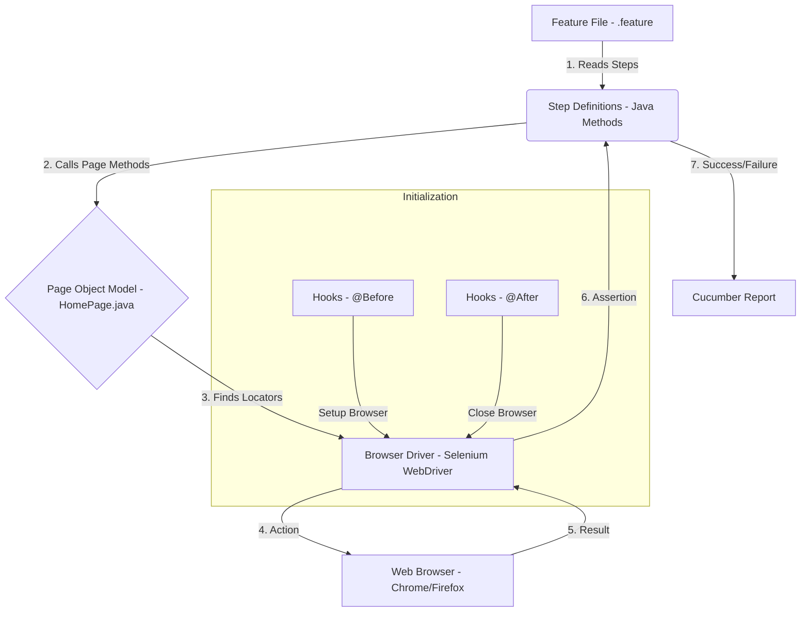
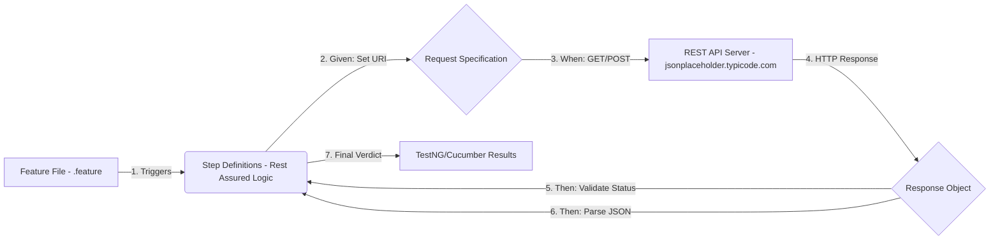
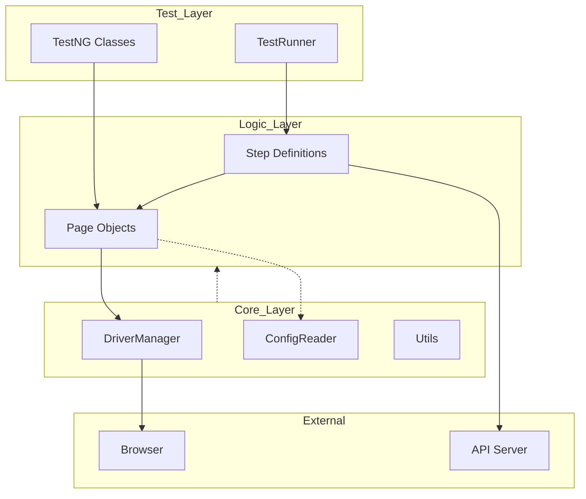

# 📊 Automation Flow Diagrams

This document visualizes the internal logic and execution flow of the **Nishad IT Solutions** framework.

---

## 🖥️ 1. UI Automation Flow (Selenium + BDD)
This diagram shows how a Gherkin scenario translates into browser actions.

---

## 📡 2. API Automation Flow (Rest Assured + BDD)
This diagram shows the direct communication between the script and the server.

---

## 🏗️ 3. The Hybrid Framework Architecture
The overall structure of how our components interact.

### 🔑 Architecture Legend

| Abbreviation | Long Form | Description |
| :--- | :--- | :--- |
| **TR** | **TestRunner** | The engine that triggers Cucumber feature files. |
| **TC** | **TestNG Classes** | Standard Java test classes using TestNG annotations. |
| **SD** | **Step Definitions** | The bridge between Gherkin steps and Java logic. |
| **PO** | **Page Objects** | Classes representing web pages and their actions. |
| **DM** | **DriverManager** | Handles the lifecycle of the Selenium WebDriver. |
| **CR** | **ConfigReader** | Reads environment settings from `config.properties`. |
| **UT** | **Utils** | Reusable helper methods (logs, screenshots, waits). |
| **BW** | **Browser** | The target UI (Chrome, Firefox, Edge). |
| **SV** | **API Server** | The target REST API endpoint. |
